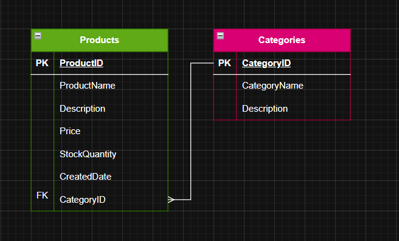

# Simple Product API

A RESTful API for managing products and categories using FastAPI, SQLite, and SQLAlchemy.

## Features
- Create, read, update, and delete products
- Create, read, update, and delete categories
- Assign products to categories
- Pagination support for listing products and categories
- Interactive API docs via Swagger UI

## Project Structure
- `main.py` — FastAPI app entry point, includes routers
- `models.py` — SQLAlchemy ORM models for Product and Category
- `schemas.py` — Pydantic schemas for request/response validation
- `crud.py` — CRUD operations for database interaction
- `database.py` — Database connection and session management
- `routers/` — API endpoints for products and categories

## Entity Relationship Diagram



- **Category** (id, name, description)
    - One-to-many relationship with **Product**
- **Product** (id, name, description, price, stock_quantity, created_at, category_id)
    - Belongs to a **Category**

## API Endpoints

### Products (`/products`)
- **POST `/products/`**: Create a new product
- **GET `/products/`**: List products (with pagination)
- **GET `/products/{product_id}`**: Get product details by ID
- **PUT `/products/{product_id}`**: Update a product
- **DELETE `/products/{product_id}`**: Delete a product

### Categories (`/cetegories`)
- **POST `/cetegories/`**: Create a new category
- **GET `/cetegories/`**: List categories (with pagination)
- **GET `/cetegories/{category_id}`**: Get category details by ID
- **PUT `/cetegories/{category_id}`**: Update a category
- **DELETE `/cetegories/{category_id}`**: Delete a category

## How to Run Locally
```sh
pip install -r requirements.txt
uvicorn main:app --reload
```
Access the API docs at [http://localhost:8000/docs](http://localhost:8000/docs).

## Example Usage
- Create a product: `POST /products/`
- List products: `GET /products/`
- Create a category: `POST /cetegories/`
- List categories: `GET /cetegories/`

## Testing
You can test endpoints using Swagger UI or tools like Postman.
